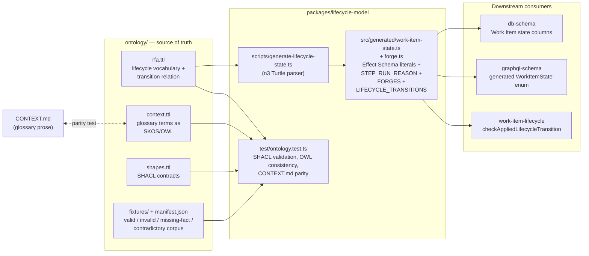
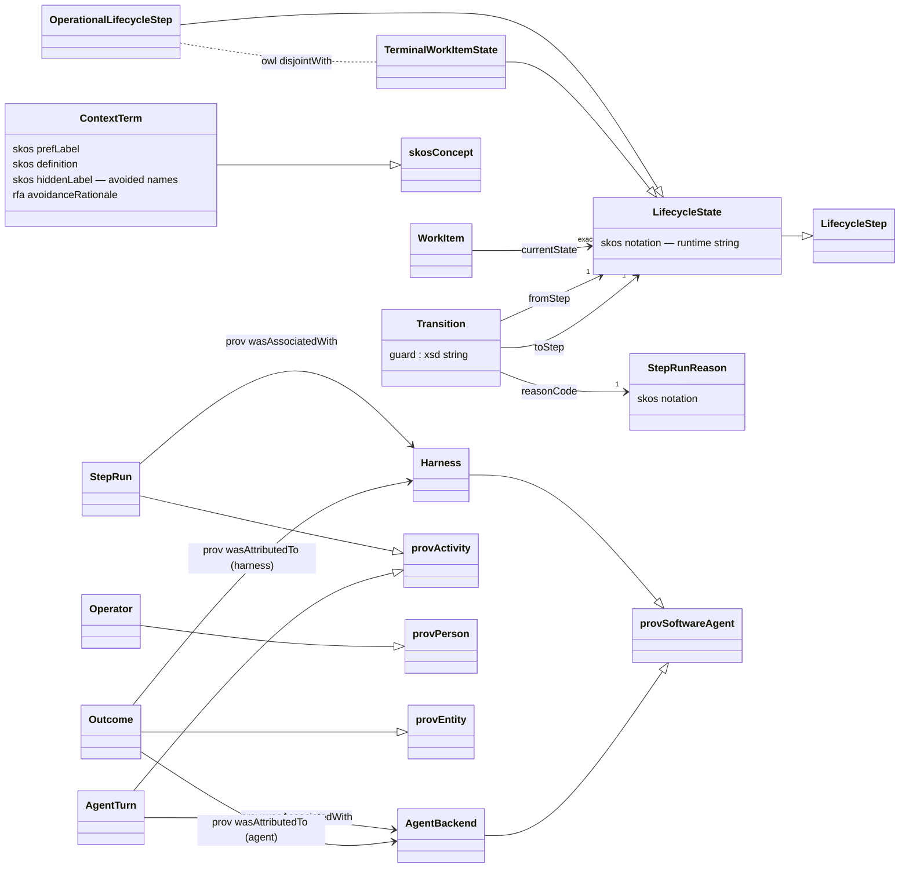
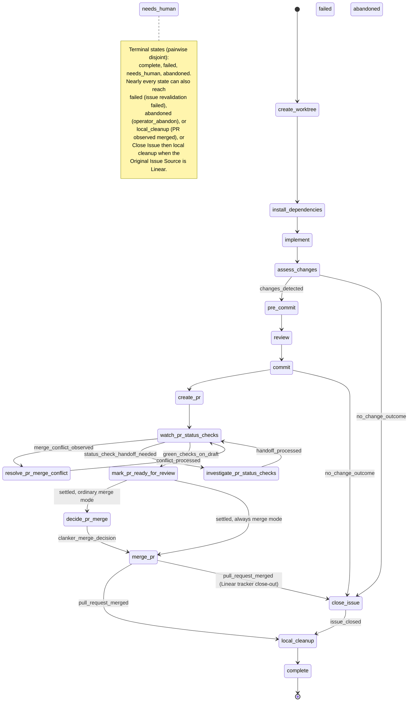

# Ready for Agent ontology

This directory is the machine-readable domain model of Ready for Agent: the
Work Item lifecycle vocabulary, the CONTEXT.md glossary as a SKOS/OWL graph,
and the SHACL contracts that validate data against both. It implements the
neurosymbolic approach described in
[docs/why-agentic-systems-need-ontologies.md](../docs/why-agentic-systems-need-ontologies.md):
probabilistic agents propose, but the meaning of a Work Item state, the legal
transition relation, and the vocabulary itself are formal, testable artifacts
— not prompt prose.

The ontology is a production interface, not documentation. TypeScript state
types, the GraphQL `WorkItemState` enum, database state columns, and the
runtime transition check are all generated from or validated against these
files. Changing the lifecycle means changing `rfa.ttl` first.

## Files

| File | Role |
| --- | --- |
| `rfa.ttl` | The `rfa:` vocabulary (OWL + SKOS): lifecycle states, the full declared transition relation with guards and Step Run reason codes, disjointness axioms, and PROV-O alignment of execution concepts. |
| `context.ttl` | Every CONTEXT.md glossary term as an `rfa:ContextTerm` (an OWL class and SKOS concept) with its preferred label, definition, avoided labels (`skos:hiddenLabel`), and per-label `rfa:avoidanceRationale` annotations. |
| `shapes.ttl` | SHACL node shapes: closed-world contracts for context terms, lifecycle vocabulary, transitions, Work Items, and PROV-aligned execution records. |
| `fixtures/` | A validation corpus with an asserted verdict per fixture in `manifest.json`: valid, invalid, missing-fact, and contradictory data graphs. |

Namespace: `rfa:` = `https://ready-for-agent.dev/ontology/rfa#`. Reused
vocabularies: SKOS (labels, definitions, notations), OWL 2 (classes,
disjointness, restrictions), PROV-O (activities, agents, entities), Dublin
Core (ontology metadata).

## How the ontology reaches the code



The generator (`bunx nx run lifecycle-model:generate`) parses `rfa.ttl` and
emits `packages/lifecycle-model/src/generated/work-item-state.ts` and
`packages/lifecycle-model/src/generated/forge.ts`:

- `OPERATIONAL_LIFECYCLE_STEPS` and `TERMINAL_WORK_ITEM_STATES` — the state
  space, keyed by each term's `skos:notation` (the runtime string, e.g.
  `create_worktree`).
- `WorkItemState` — an Effect `Schema.Literals` union over both.
- `STEP_RUN_REASONS` / `STEP_RUN_REASON` — every `rfa:StepRunReason`
  (`skos:notation` plus camelCase accessor), the complete harness vocabulary.
- `FORGES` / `Forge` / `isForge` — the three supported Forge kinds
  (`github`, `gitlab`, `azure-devops`) from `rfa:Forge` `owl:oneOf`, in
  declared order. GraphQL keeps the existing string wire contract.
- `ISSUE_TRACKERS` / `IssueTracker` / `isIssueTracker` — the Issue Tracker
  kinds (`github`, `gitlab`, `azure-devops`, `linear`, `fp`) from
  `rfa:IssueTracker` `owl:oneOf`. Linear and fp are Issue Trackers only, not
  Forges. `DEFAULT_ISSUE_TRACKER_BY_FORGE` maps each Forge to itself.
- `LIFECYCLE_TRANSITIONS` — every declared `rfa:Transition` as queryable data
  (`from`, `to`, `guard`, `reasonCode`).
- `isDeclaredLifecycleTransition(from, to)` — membership in the declared
  relation.

CI runs `check-generated`, so the checked-in TypeScript can never drift from
`rfa.ttl`. At runtime, `work-item-lifecycle` wraps every applied state change
in `checkAppliedLifecycleTransition`: an undeclared pair is a logged warning
in production ("observe" mode) and a fatal invariant defect under test
("strict" mode) — so the lifecycle suite proves every exercised transition is
declared in the ontology.

## The semantic model



Notes on the modelling:

- **Punning.** Each lifecycle value (e.g. `rfa:Implement`) is declared as an
  OWL class, an OWL named individual, and a SKOS concept at once. As an
  individual it can be the object of `rfa:currentState` and a transition
  endpoint; as a class it participates in subclass and disjointness axioms;
  as a SKOS concept it carries the label, definition, and `skos:notation`
  that becomes the runtime string.
- **Disjointness as guardrails.** The four terminal states are pairwise
  disjoint, all twenty lifecycle values are pairwise disjoint, operational
  steps are disjoint from terminal states, and prose-fought distinctions are
  encoded as axioms: Repository `rfa:Paused` vs `rfa:PauseWorkItem`,
  `rfa:WaitingForBlockers` vs `rfa:AdmittedWorkItem`, and the three Merge
  Policy states (`rfa:MergePolicyOff`, `rfa:MergePolicyClassify`,
  `rfa:MergePolicyAlways`). Merge Mode Always is the same Always as Merge
  Policy `always` (`owl:equivalentClass`); they are not disjoint. A data
  graph that conflates any of the disjoint pairs becomes inconsistent (see
  `fixtures/contradictory.ttl`).
- **Provenance.** Execution concepts align with PROV-O so outcomes are
  attributable: a Step Run is a harness activity, an Agent Turn is an agent
  backend activity, and every Outcome must name the Agent Backend or the
  Harness it is attributed to.

## The lifecycle state space

16 operational Lifecycle Steps, 4 terminal Work Item states, and 180 declared
transitions, each carrying a named guard and one Step Run reason code from the
generated vocabulary.
The happy path:



The full relation — including per-state revalidation failures, operator
abandon, merged-PR supersession, refresh-observed merges, and the Needs
Human / Failed retry edges — lives in `rfa.ttl` and is exported verbatim as
`LIFECYCLE_TRANSITIONS`.

## Validation layers

Following the layering in the ontologies doc, each concern lives in its own
formalism and is tested in `packages/lifecycle-model/test/ontology.test.ts`:

1. **Typed boundary** — the generated Effect schemas
   (`WorkItemState` and friends) reject unknown state strings at the edges,
   and `db-schema` / `graphql-schema` derive their enums from the same
   arrays.
2. **Semantic consistency (OWL)** — disjointness axioms are checked with a
   custom consistency pass; the contradictory fixture must be reported
   inconsistent, and the test suite proves an injected contradiction is
   detected.
3. **Closed-world validation (SHACL)** — `shapes.ttl` requires exactly one
   `rfa:currentState` from the enumerated state list per Work Item, complete
   transitions (one from-step, to-step, guard, and reason code each), labeled
   and defined vocabulary terms, and PROV attribution on execution records.
4. **Vocabulary parity** — the CONTEXT.md glossary and `context.ttl` are kept
   in exact bidirectional parity (headings, definitions, and avoided labels),
   so the prose glossary and the graph cannot diverge.
5. **Runtime relation check** — `checkAppliedLifecycleTransition` in
   `work-item-lifecycle` observes (production) or enforces (tests) that every
   applied transition is declared.

The fixture corpus mirrors the doc's recommended test matrix — valid
examples, invalid examples, missing facts, and contradictory facts — with
each file's expected SHACL and consistency verdict asserted in
`fixtures/manifest.json`.

## Working on the ontology

```sh
# Regenerate the TypeScript state space after editing rfa.ttl
bunx nx run lifecycle-model:generate

# Regenerate the GraphQL WorkItemState enum
bunx nx run graphql-schema:generate

# Verify generated code is current (also runs in CI, before tests)
bunx nx run lifecycle-model:check-generated

# Run the ontology test suite (SHACL, consistency, parity, fixtures)
bunx nx run lifecycle-model:test
```

When adding a lifecycle state, transition, or Step Run reason:

1. Declare it in `rfa.ttl` (class + individual + SKOS concept with a
   `skos:notation`, or an `rfa:Transition` with `fromStep`, `toStep`,
   `guard`, and `reasonCode`, or an `rfa:StepRunReason` with `skos:notation`
   and `skos:definition`).
2. If it is a CONTEXT.md glossary term, add the glossary entry and mirror it
   in `context.ttl` — the parity test fails on any mismatch.
3. Regenerate `lifecycle-model` and `graphql-schema`, and update fixtures if
   the change affects what counts as valid or contradictory data.

The ontology version is tracked as `owl:versionInfo` on
`<https://ready-for-agent.dev/ontology/rfa>` in `rfa.ttl`.
